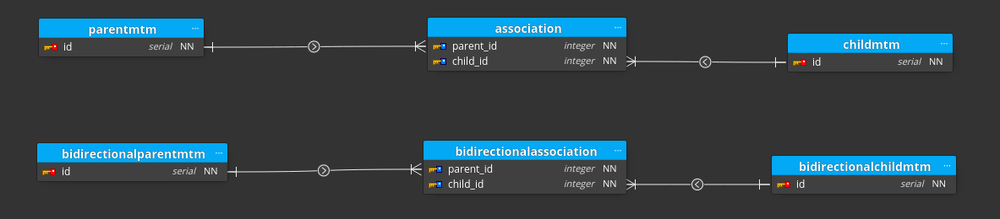
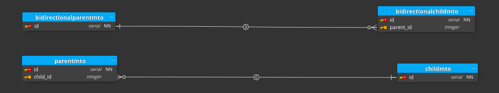
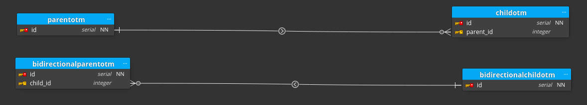
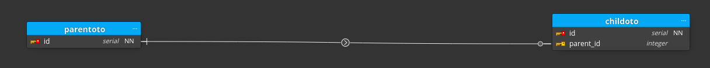

# sqlalchemy-visualized

A collection of common sqlalchemy relationships visualized through ERD software. (MIT Licensed)

---

I have used [Moon Modeler](https://www.datensen.com/data-modeling/moon-modeler-for-databases.html) to connect to the database and visualize the relationships.
I don't work for them but I really like their software and highly recommend checking out the trial and paying for it if you find it useful.

### Todo
- Implement common pre-made database models. Some inspiration can be found at [erdiagrams.com](http://erdiagrams.com/erdiagrams1.html) and other related sites

## Many-to-many

## Many-to-one

## One-to-many

## One-to-one

